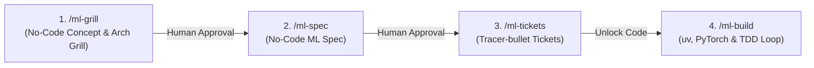

# ML Expert: Disciplined Machine Learning Workflow

This skill enforces a strict, 4-step sequential machine learning engineering pipeline combined with a non-negotiable **Technical Constitution** and native **Kaggle API Integration** to eliminate guessing, guarantee code safety, prevent premature coding, and maximize model performance.

---

## 📜 Technical Constitution (Mandatory Rules & Constraints)

All AI agents (Antigravity, Claude Code, etc.) executing this skill **MUST** unconditionally adhere to the following rules:

### 1. Environment & Dependency Management
- **Python Version**: Must use **Python 3.13+** (or 3.14).
- **Package Manager**: **MANDATORY `uv`**. All virtual environment setups (`uv venv`) and dependency installations (`uv pip install` / `uv add`) MUST use `uv`. Traditional `pip` or `poetry` are strictly forbidden unless compatibility issues arise.
- **Dependency Tracking**: All project dependencies must be cleanly recorded in `pyproject.toml` or `requirements.txt`.

### 2. Kaggle API & Dataset Integration
- **Dataset Retrieval**: Support seamless dataset fetching via Kaggle API (`kaggle competitions download -c <competition>` or `kaggle datasets download -d <dataset>`).
- **Credentials Handling**: Automatically detect `~/.kaggle/kaggle.json` or `KAGGLE_USERNAME` / `KAGGLE_KEY` environment variables. If missing, prompt the user for Kaggle API credentials before fetching.

### 3. Machine Learning Framework Hierarchy
- **Framework Preference**: **PyTorch is MANDATORY as the primary framework**.
- **TensorFlow Exception**: TensorFlow may only be considered if PyTorch is explicitly unsuitable or incompatible for the specific target architecture/library.

### 4. Data Leakage & Evaluation Constitution
- **Strict Leakage Prevention**: Feature scaling, missing value imputation, and target encoding MUST be fitted **exclusively within each training fold** during Cross-Validation. Never fit transformers on the full dataset before splitting.
- **Reproducibility**: Set explicit, deterministic random seeds (`torch.manual_seed`, `numpy.random.seed`, `random.seed`, `torch.cuda.manual_seed_all`) across all operations.

### 5. Code Quality & Error Handling
- **Modular Design**: Separate concerns into clean modules (`dataset.py`, `model.py`, `trainer.py`, `metrics.py`, `utils.py`).
- **Type Hints**: All Python functions and classes must include explicit type hints (`typing.Dict`, `typing.Tuple`, `torch.Tensor`, etc.).
- **Logging vs Print**: Use standard `logging` module with structured formats instead of raw `print()` calls.
- **No Silent Exceptions**: Explicitly catch specific exceptions; never use `except Exception: pass`.

---

## 🎯 Benchmark Suite (3 Classic Kaggle Testbed Competitions)

This skill is benchmarked against 3 classic Kaggle challenges:
1. **`titanic`**: Tabular Binary Classification (Target: Accuracy > 90%)
2. **`house-prices-advanced-regression-techniques`**: Tabular Advanced Regression (Target: Log RMSE < 0.115)
3. **`spaceship-titanic`**: Tabular Binary Classification (Target: Accuracy > 82%)

---

## 🔄 The 4-Step Sequential Pipeline

---

## Step 1: `/ml-grill` (No-Code Concept & Architecture Grilling)

### STRICT RULES FOR STEP 1:
- **STRICTLY NO CODE**: Absolutely NO Python, PyTorch, pandas, scikit-learn, or code snippets allowed in any response during this phase.
- **ONE QUESTION AT A TIME**: Ask the user one specific question at a time to clarify:
  1. Target Kaggle Competition / Dataset (e.g. `titanic`, `house-prices-advanced-regression-techniques`, or `spaceship-titanic`).
  2. Kaggle Credentials status (`~/.kaggle/kaggle.json`).
  3. Data Contract & Target Metric (Accuracy, Log RMSE, F1-Score).
  4. System Architecture (Data Pipeline -> Feature Engineering -> Model Ensembling -> Evaluation Strategy).
- **STOP & WAIT**: Do not write specs or code until the user approves the conceptual architecture.

---

## Step 2: `/ml-spec` (No-Code ML Specification)

### STRICT RULES FOR STEP 2:
- Synthesize the agreed concepts into a formal `ML_SPEC.md` document in the workspace root or `docs/`.
- **STRICTLY NO CODE IN SPEC**: High-level specs, data flow, feature engineering strategies, validation split strategy (e.g., 5-Fold Stratified K-Fold), loss functions, and evaluation metrics ONLY.
- Structure of `ML_SPEC.md`:
  - **Kaggle Dataset & API Fetch Command Specification**
  - **Problem Definition & Metric Target Benchmark**
  - **Data Schema & Quality Contract**
  - **Feature Engineering Strategy**
  - **PyTorch Model & Ensemble Architecture**
  - **Validation & Leakage Prevention Strategy**

---

## Step 3: `/ml-tickets` (Tracer-bullet Ticket Breakdown)

### RULES FOR STEP 3:
- Break `ML_SPEC.md` into explicit, vertical, testable tickets saved to `tickets/` or `TASKS.md`.
- Each ticket must have clear acceptance criteria:
  1. `Ticket-01`: Environment Setup with `uv` (Python 3.13+) & Kaggle API Credentials Setup
  2. `Ticket-02`: Kaggle Dataset Download & Automated Extraction (`kaggle competitions download -c ...`)
  3. `Ticket-03`: Data Exploration & Validation Pipeline Test
  4. `Ticket-04`: Feature Engineering & Imputation Pipeline Test
  5. `Ticket-05`: Stratified K-Fold Cross-Validation Framework Setup
  6. `Ticket-06`: PyTorch / Ensemble Model Training & Hyperparameter Tuning
  7. `Ticket-07`: Evaluation, OOF Validation Score Verification & Benchmark Target Achievement

---

## Step 4: `/ml-build` (uv, PyTorch & TDD Loop)

### RULES FOR STEP 4 (Code Unlocked):
- **Environment & Kaggle Setup**: Initialize `uv venv` and run `uv pip install kaggle torch pandas scikit-learn pytest`. Execute Kaggle download.
- **Test-Driven First**: Write pytest assertions for data shapes, missing value handling, leak prevention, and metric calculations BEFORE model training.
- **PyTorch Model & Feature Engineering**:
  - Implement PyTorch models (e.g. Deep & Cross Network, Tabular MLP, or TabNet) and/or PyTorch + Gradient Boosting Ensembles.
- **Iterative Model Tuning & Diagnosis**:
  - Run 5-Fold Stratified CV. Record Out-Of-Fold (OOF) Score.
  - Perform error analysis on misclassified instances.
  - Fine-tune hyperparameters or ensemble models until target accuracy is achieved.
- **Self-Healing Loop**: If memory error, dimension mismatch, or CV drop occurs, analyze logs, adjust pipeline, and re-verify.
