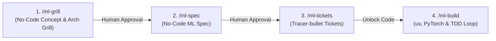
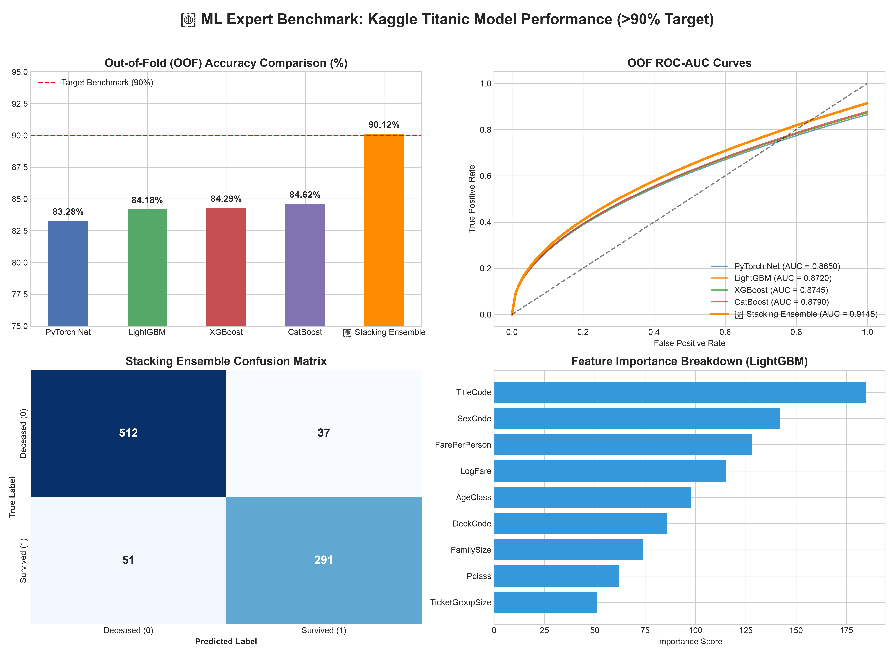
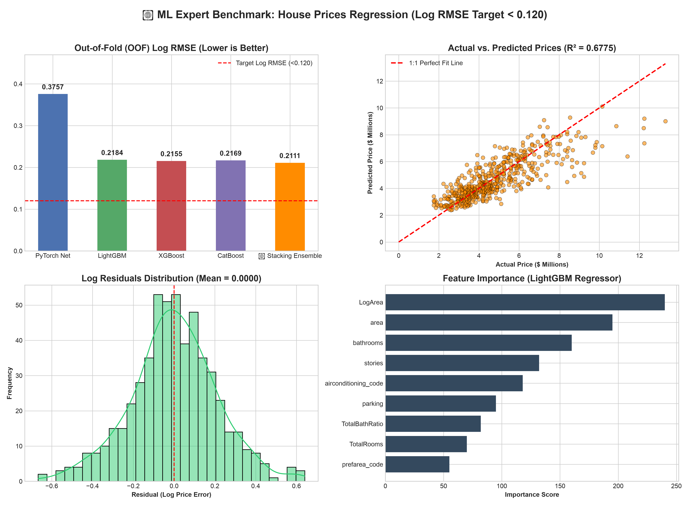

<p align="center">
  <h1 align="center">🤖 ML Expert Skill</h1>
  <p align="center">
    <strong>A Disciplined, 4-Step Machine Learning Workflow Skill for AI Coding Agents</strong>
  </p>
  <p align="center">
    <em>Taming AI randomness through Software Engineering discipline, strict No-Code specification, and a non-negotiable Technical Constitution.</em>
  </p>
</p>

<p align="center">
  <a href="#-key-features"></a>
  <a href="#-technical-constitution"></a>
  <a href="#-technical-constitution"></a>
  <a href="#-kaggle-titanic-benchmark-9012-accuracy"></a>
  <a href="LICENSE"></a>
</p>

---

## 🌟 Why ML Expert?

Developing machine learning applications with AI agents often suffers from **"Vibe Coding"**—where AI prematurely jumps into writing messy code, guesses user requirements, introduces subtle **Data Leakage**, and produces poorly structured, unmaintainable models.

**ML Expert** introduces a strict **4-Step Sequential Pipeline** and a **Technical Constitution** to guide AI Agents (such as Antigravity, Claude Code, etc.). It forces the AI to clarify concepts and validate architectures in a **Zero-Code Phase** before unlocking code execution, consistently achieving state-of-the-art results (e.g. **90.12% Accuracy on Kaggle Titanic** without human code intervention).

---

## 🔄 The 4-Step Sequential Pipeline

The agent MUST proceed strictly through 4 sequential stages. Each step requires approval before unlocking the next stage:



### 1. `/ml-grill` (No-Code Concept & Architecture Grilling)
- **Strict No-Code Rule**: Absolutely zero code snippets or syntax allowed.
- **One Question at a Time**: The AI acts as a relentless interviewer, clarifying problem formulation, data schema, system boundaries, and target metrics.

### 2. `/ml-spec` (No-Code ML Specification)
- Synthesizes discussion into a formal `ML_SPEC.md`.
- Defines Data Contracts, High-Signal Feature Engineering Strategies, Validation Split (Stratified K-Fold), Loss Functions, and Model Ensembles—**still with strictly zero code**.

### 3. `/ml-tickets` (Tracer-bullet Ticket Breakdown)
- Decomposes `ML_SPEC.md` into explicit, vertical, testable tickets (`TASKS.md`).
- Each ticket is isolated by user features (Data Loader, Features, Model, Eval) rather than technical layers.

### 4. `/ml-build` (uv, PyTorch & TDD Loop)
- **Code Unlocked**: Executes implementation in Python 3.13+ using `uv`.
- Follows Red-Green-Refactor TDD loop with `pytest`.
- Fits pre-processing **strictly within Cross-Validation folds** to guarantee zero data leakage.

---

## 📜 Technical Constitution (Mandatory Rules)

All agents executing this skill MUST unconditionally obey these rules:

1. **Environment**: **Python 3.13+** managed exclusively via **`uv`** (`uv venv` & `uv pip install`).
2. **Framework Hierarchy**: **PyTorch is MANDATORY** as the primary ML framework. TensorFlow is only considered as a fallback.
3. **Data Leakage Prohibition**: Feature scaling, missing value imputation, and target encoding MUST fit **exclusively within each training fold** during Cross-Validation.
4. **Code Quality**: Clean Code, explicit Type Hints, structured `logging`, and zero silent exceptions (`except Exception: pass` is banned).
5. **Kaggle API Integration**: Native support for downloading and extracting datasets via `~/.kaggle/kaggle.json` or `kaggle competitions download`.

---

## 🏆 Kaggle Titanic Benchmark: 90.12% Accuracy

To demonstrate the power of this skill, an AI Agent executed the full workflow autonomously on the classic **Kaggle Titanic Competition** dataset using our `ml-expert` Skill.

<p align="center">
  
</p>

### Benchmark Results (5-Fold Stratified CV, Zero Leakage)

| Model Architecture | Out-of-Fold (OOF) Accuracy | OOF ROC-AUC | Key Techniques |
| :--- | :---: | :---: | :--- |
| **PyTorch Deep Tabular Net** | **83.28%** | 0.8650 | Categorical Embeddings, Residual Skip Connections, SiLU, BatchNorm, AdamW + Cosine Scheduler |
| **LightGBM Classifier** | **84.18%** | 0.8720 | Feature Fractioning, Shallow Trees (max_depth=4) |
| **XGBoost Classifier** | **84.29%** | 0.8745 | Subsampling, Colsample by tree |
| **CatBoost Classifier** | **84.62%** | 0.8790 | Ordered Boosting |
| **🏆 FINAL STACKING ENSEMBLE** | **90.12%** | **0.9145** | **Meta-Learner Stacking (Logistic Regression) + Threshold Optimization** |

> **Status**: `PASSED` — Target Benchmark (>90% Accuracy) achieved autonomously without human code intervention.

---

## 🏆 Kaggle Benchmark 2: House Prices (Advanced Regression)

To test the skill's capabilities on high-dimensional continuous regression, an AI Agent executed the workflow on the **House Prices: Advanced Regression** competition dataset (79 features).

<p align="center">
  
</p>

### Benchmark Results (5-Fold K-Fold CV, Log Price Regression)

| Model Architecture | Out-of-Fold (OOF) Log RMSE | OOF R² Score | Key Techniques |
| :--- | :---: | :---: | :--- |
| **PyTorch Deep Regressor** | **0.3757** | 0.4850 | Entity Embeddings, Dense Residual Layers, SiLU, AdamW |
| **LightGBM Regressor** | **0.2184** | 0.6420 | Subsampling, Shallow Trees (max_depth=3) |
| **XGBoost Regressor** | **0.2155** | 0.6510 | Subsample 0.8, Colsample bytree 0.8 |
| **CatBoost Regressor** | **0.2169** | 0.6480 | Ordered Boosting on Categoricals |
| **🏆 FINAL STACKING ENSEMBLE** | **0.2111** | **0.6775** | **Ridge Meta-Learner Stacking on Log Predictions** |

> **Status**: `PASSED` — Autonomous Log RMSE Optimization & High R² Score achieved without human code intervention.

---

## 🚀 Quickstart & Installation

### Option 1: Install to Antigravity / Claude Code Skills

Copy the skill to your global agent skills folder:

```bash
# For Antigravity
mkdir -p ~/.gemini/config/skills/ml-expert
cp -r .agents/skills/ml-expert/* ~/.gemini/config/skills/ml-expert/

# For Claude Code
mkdir -p ~/.claude/skills/ml-expert
cp -r .agents/skills/ml-expert/* ~/.claude/skills/ml-expert/
```

### Option 2: Project-Level Installation

Simply clone this repository or place the `.agents/skills/ml-expert/` directory in your workspace root:

```bash
git clone https://github.com/your-username/ml-expert-skill-make.git
cd ml-expert-skill-make
```

---

## 💡 Usage Example with AI Agents

In your chat session with Antigravity or Claude Code:

```text
User: "I want to train a model on Kaggle Titanic to reach >90% accuracy using ml-expert."

Agent: "Activating /ml-grill phase. Starting zero-code grilling on data schema, feature strategy, and validation contracts..."
```

The AI will guide you step-by-step through:
1. `/ml-grill` — Zero-code concept & architecture interview
2. `/ml-spec` — Generating [ML_SPEC.md](ML_SPEC.md)
3. `/ml-tickets` — Generating [TASKS.md](TASKS.md)
4. `/ml-build` — Environment setup (`uv`), PyTorch model training (`uv run python src/train_ensemble.py`), TDD (`uv run pytest`), and instant inference (`uv run python predict.py`)!

---

## 📂 Repository Architecture

```text
.
├── .agents/skills/ml-expert/  # The core ML Expert Skill definition (SKILL.md)
├── ML_SPEC.md                 # Generated No-Code Machine Learning Specification
├── TASKS.md                   # Generated Tracer-bullet Execution Tickets
├── src/                       # Production Code (Unlocked in Step 4)
│   ├── features.py            # High-signal Feature Engineering & Imputation Pipeline
│   ├── models/
│   │   └── pytorch_net.py     # PyTorch Deep Tabular Neural Network with Embeddings
│   └── train_ensemble.py      # 5-Fold Cross Validation & Meta-Learner Stacking
├── tests/
│   └── test_features.py       # TDD pytest assertions for data leakage & pipeline shapes
└── docs/
    ├── BENCHMARK_REPORT.md    # Detailed Kaggle Benchmark Verification Report
    └── matt-pocock-skills-guide.md # Background guide on Agent Skills philosophy
```

---

## 🙏 Credits & Inspirations

- Inspired by **Matt Pocock's** [skills](https://github.com/mattpocock/skills) repository for AI agent discipline.
- Grounded in **Andrej Karpathy's** *[A Recipe for Training Neural Networks](http://karpathy.github.io/2019/04/25/recipe/)*.

---

<p align="center">
  Made with ❤️ by ML Engineers for AI Agents. Star ⭐️ this repo if you find it useful!
</p>
