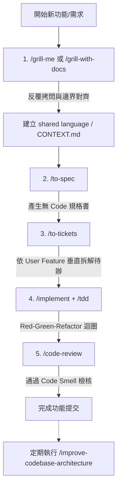

# Matt Pocock AI 開發工具包 (Skills) 完整指南與工作流指南

本指南整理自 TypeScript 專家 Matt Pocock 開源的 [mattpocock/skills](https://github.com/mattpocock/skills) 專案。這套 AI 開發工具包的核心宗旨在於：**透過軟體工程的經驗與專業術語來控制 AI 的隨機性，讓 AI 成為嚴謹且高產出的工程開發夥伴。**

---

## 1. 核心哲學與為甚麼需要這套工具？

### 1.1 解決 AI 開發的痛點
- **拒絕「Vibe Coding」（憑感覺寫程式）**：AI 是一個充滿隨機性的黑盒子。若直接讓 AI 憑感覺自由寫 Code，它往往會缺乏宏觀架構觀念，拆出難以維護的系統。
- **解決對齊與溝通落差 (Misalignment)**：開發軟體最大的失敗因素通常是人類與 AI 之間的需求理解差異。
- **防止冗長與記憶體超載**：AI 在未建立專案術語時，容易使用大篇幅描述簡單概念，消耗過多 Token 與 Context。

### 1.2 設計哲學：極簡主義與模組化 (Minimalism & Composability)
- **拒絕綁架開發流程**：市面上許多 AI 框架（如 Superpowers、GSD、BMAD）嘗試全面掌控開發流程，反而讓除錯變得極為困難。
- **人類掌握決策主導權**：Matt Pocock 採用極簡與可自由拼裝的 Skill 設計，每個 Skill 功能專一，將軟體架構的決定權重新交還給工程師。

---

## 2. 核心工作流與重要 Skill 拆解

### 2.1 `grill-me` / `grill-with-docs`（拷問需求）
* **作用**：在寫任何程式碼前，強制 AI 扮演嚴格的面試官反向「拷問」開發者，挖出潛在的盲點與邊界條件。
* **關鍵規則**：
  * 整個 Skill 指令極簡且精確。
  * **嚴格規定 AI 每次只能問一個問題**，並提供可能的選項或建議。
  * 在人類與 AI 達成完全共識前，**絕對不准寫任何程式碼**。
* **文件整合 (`/grill-with-docs`)**：
  * 在拷問過程中同步更新專案的通用語言庫 (`CONTEXT.md`) 與架構決策紀錄 (ADR)。

### 2.2 `to-spec`（撰寫規格書）
* **作用**：將剛才在 `grill-me` 中討論出來的共識整理成結構化的規格文件 (Specification)。
* **關鍵規則**：
  * **嚴禁 AI 在規格書中寫入任何具體程式碼或應用程式片段**。
  * 目的：避免未來程式碼迭代重構時，過期的範例 Code 混淆 AI 的判斷。

### 2.3 `to-tickets`（拆解任務）
* **作用**：將規格書進一步拆解成具體且可執行的待辦 Ticket。
* **核心方法論 (Tracer-bullet Tickets)**：
  * **強制按「使用者功能 (User Feature)」垂直切割**：例如一個「登入功能」包含其對應的資料庫 Schema、後端 API 與前端 UI，而不是照技術架構分工。
  * **優點**：每完成一個 Ticket 即可立即打開瀏覽器進行端到端測試，且便於平行發包與獨立關閉。

### 2.4 `implement` 與 `tdd`（測試驅動開發）
* **作用**：進入程式碼實作階段。
* **防作弊機制 (Red-Green-Refactor Loop)**：
  * 規定在寫任何功能邏輯前，**必須先編寫單元/整合測試**。
  * 強制測試先跑出紅燈 (Fail)，接著實作最小可行程式碼讓紅燈轉為綠燈 (Pass)，最後進行重構。
  * 防止 AI 為了交差而寫出會自行作弊或虛假的測試。

### 2.5 `code-review`（程式碼審查與軟體工程原則）
* **作用**：在 Commit 前對 Diff 進行雙軸審查（標準符合度與規格忠實度）。
* **對照《Refactoring》（重構）壞味道檢核**：
  1. **Shotgun Surgery (散彈式修改)**：修改一個小功能卻動到了十幾個無關的檔案。
  2. **Feature Envy (依戀情結)**：把某個模組的邏輯寫在了錯誤的檔案或物件中。
  3. **Data Clumps (資料泥團)**：總是綁在一起出現的變數（如姓名、電話、地址）沒有封裝成獨立物件。

---

## 3. 對付 AI 的「潛模組危機」 (Deep Modules vs. Shallow Modules)

### 3.1 淺模組 vs. 深模組
- **淺模組 (Shallow Modules)**：介面複雜但提供的功能有限，就像沒有大門的房子，內部邏輯四散。導致 AI 閱讀程式碼時容易迷路、 Context 爆掉並產生幻覺。
- **深模組 (Deep Modules)**：提供極簡單的對外大門（例如一個 `processCheckout` 函式），將複雜的實現細節隱藏在背後。給予 AI 極佳的局部視野，能精準定位並修復 Bug。

### 3.2 `improve-codebase-architecture`（架構大掃除）
- 定期診斷專案架構的工具。
- 在腦中模擬「拔掉這個模組會不會天下大亂」，揪出多餘的空殼模組與過度封裝。
- 生成視覺化的 HTML 診斷報告，引導開發者進行結構重構。

---

## 4. 全域安裝與使用指南

### 4.1 全域 Skills 安裝位置
已將所有 Skills 安裝至系統全域目錄：
`~/.claude/skills/`

### 4.2 常用 Skills 指令對照表

| Skill 指令 | 類型 | 說明 |
| :--- | :--- | :--- |
| `/setup-matt-pocock-skills` | User-invoked | 專案初始化設定（設定 Issue Tracker、Labels 與文件路徑） |
| `/ask-matt` | User-invoked | 詢問目前的開發情境適合使用哪一個 Skill |
| `/grill-me` | User-invoked | 需求對齊與拷問（非程式碼/通用） |
| `/grill-with-docs` | User-invoked | 需求對齊並自動更新 `CONTEXT.md` 與 ADR |
| `/to-spec` | User-invoked | 將對話與共識轉換成無 Code 規格書 |
| `/to-tickets` | User-invoked | 將規格書拆解為具體執行的 Tracer-bullet Tickets |
| `/implement` | User-invoked | 執行 Ticket 並結合 TDD 與 Code Review 流程 |
| `/tdd` | Model-invoked | 執行 Red-Green-Refactor 測試驅動開發迴圈 |
| `/code-review` | Model-invoked | 審查程式碼品質與 Fowler 12 種 Code Smells |
| `/diagnosing-bugs` | Model-invoked | 嚴謹的除錯迴圈：重現 → 最小化 → 假設 → 儀表化 → 修復 → 回歸測試 |
| `/improve-codebase-architecture` | User-invoked | 掃描專案深模組機會並產出 HTML 架構報告 |

---

## 5. 總結

Matt Pocock 的這套工具證明了一件事：**在 AI 時代，工程師更需要在自己的專業領域精進。** 唯有具備深厚的軟體工程底子，懂得運用精準的專業術語與模組化架構，才能真正駕馭 AI 這個黑盒子，把開發的主導權牢牢掌握在自己手中。
